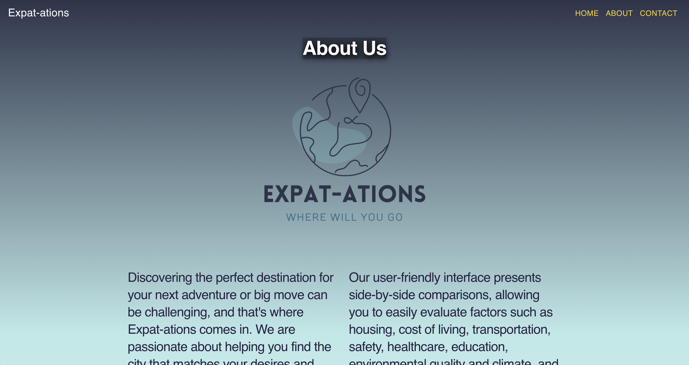

<!-- PROJECT LOGO -->

    

    Find your ideal city tailored to your preferences. Effortlessly compare 266+ cities worldwide, evaluating factors such as cost of living, quality of life, safety, healthcare, and more. If you're uncertain about your destination, let us guide you with personalized suggestions that align with your priorities. Know what to expect with Expat-ations.
     
    <a href="https://github.com/hillaryforget/Expat-ations"><strong>Explore the docs »</strong></a>
  

  
<!-- TABLE OF CONTENTS -->

  
Table of Contents

  <ol>
    <li>
      <a href="#about-the-project">About The Project</a>
      <ul>
        <li><a href="#built-with">Built With</a></li>
      </ul>
    </li>
    <li>
      <a href="#deployment">Deployment</a>
    </li>
    <li><a href="#usage">Usage</a></li>
    <li><a href="#contact">Contact</a></li>
  </ol>

<!-- ABOUT THE PROJECT -->
## About The Project

Expat-ations was created by Lighthouse Labs Web Dev students **Hillary Forget, Joon Lee, Christian Alphonse and Clayton Van Imschoot** for our finals project.

(<a href="#readme-top">back to top</a>)

### Built With

* 
* 
* 
* 
* 

(<a href="#readme-top">back to top</a>)

<!-- GETTING STARTED -->
## Deployment

Use this link to visit Expat-ations: https://expat-ations.vercel.app/

<!-- USAGE EXAMPLES -->
## Usage

<!-- CONTACT -->
## Contact

**Hillary Forget** 
 
 

**Christian Alphonse**

 

**Joon Lee**

 

**Clayton Van Imschoot**

 

**Project Link**

(<a href="#readme-top">back to top</a>)

